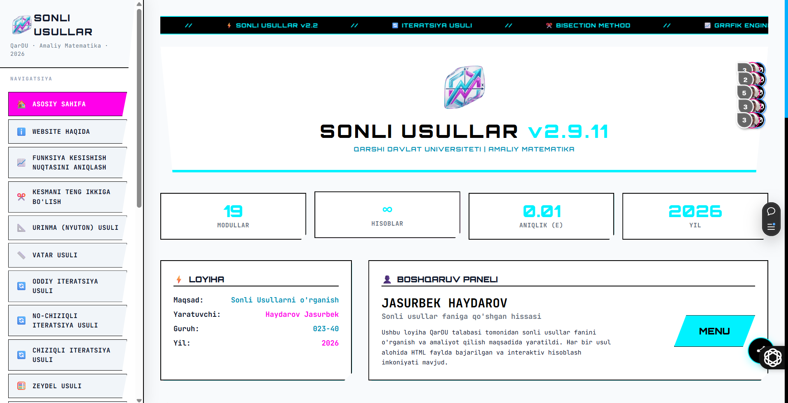
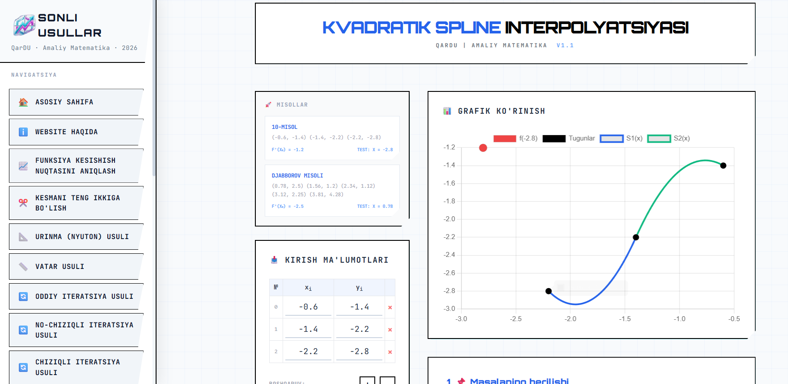
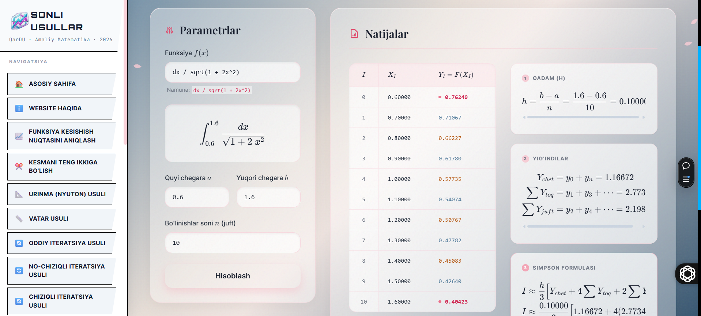

<p align="center">
  
</p>

<h1 align="center">📊 Sonli Usullar</h1>

<p align="center">
  Sonli usullar asosida matematik masalalarni yechish uchun interaktiv platforma
</p>

<p align="center">
  🌐 <a href="https://sonli-usullar.uz">sonli-usullar.uz</a>
</p>

<p align="center">
  <strong>🌍 Tillar | Languages | Языки</strong><br>
  <a href="README.md">🇺🇿 Uzbek (Oʻzbekcha)</a> • 
  <a href="README-eng.md">🇬🇧 English</a> • 
  <a href="README-ru.md">🇷🇺 Русский</a>
</p>

---

## 🚀 Loyiha haqida

**Sonli Usullar** — bu matematik tenglamalarni sonli metodlar yordamida yechish, grafiklar bilan ishlash va hisoblash jarayonini vizual ko‘rish imkonini beruvchi zamonaviy web platforma.

🔹 Loyihaning asosiy vazifasi — murakkab matematik jarayonlarni **oddiy, tushunarli va interaktiv** qilish.

---

## 📚 Adabiyotlar
**Adabiyotlar**: loyihani yaratishda foydalanilgan asosiy manbalar va qo‘llanmalar barchasi ushbu repositoriyadagi `/adabiyotlar` papkasida pdf va docx formatlarda elektron tarzda mavjud. 

- Ushbu loyihani yaratishda kitoblar, ilmiy maqolalar va onlayn resurslardan foydalanilgan hamda `QarDU`niversiteti Amaliy Matematika kafedra mudiri Sonli Usullar fani o'qituvchisi Ph.D <a href="https://scholar.google.com/citations?user=H3k2yZ0AAAAJ&hl=ru">Djabbarov Oybek Raxmanovich</a> tomonidan berilgan bilimlar asosida yaratilgan.

---

## 🖼️ Suratlar:


|||
|-|-|
|||
---

| Funksiya | Imkoniyatlari |
|-----------|---------------|
| 🔁 **Iteratsiya Usuli** | • Boshlang‘ich qiymat (x₀) <br> • Aniqlik (ε) bo‘yicha yaqinlashish <br> • Iteratsiyalarni bosqichma-bosqich ko‘rish |
| ✂️ **Kesmani Teng Ikkiqa Bo‘lish** | • [a, b] interval bilan ishlash <br> • Ildiz mavjudligini tekshirish <br> • Bosqichma-bosqich hisoblash |
| 📈 **Funksiya Kesishish Nuqtasi** | • f(x) va g(x) ni kiritish <br> • Grafik chizish <br> • Kesishish nuqtalarini topish |

---

## 🛠️ Texnologiyalar

<p align="center">


</p>

---

## ✨ Asosiy Xususiyatlar

- ✅ **Zamonaviy Interfeys** — Tushunarli va oson foydalanish
- ✅ **Real-time Grafika** — Hisoblash jarayonini vizual ko'rish
- ✅ **Detallı Hisob-kitob** — Har bir bosqichni o'rganish imkoni
- ✅ **Responsive Dizayn** — Mobil, planshetda va kompyuterda ishlaydi
- ✅ **PWA Texnologiyasi** — Offline rejimda ham ishlaydi

---

## 📋 Mavjud Sonli Usullar

### 🔢 Tenglamalar Yechish
- **Biseksiya (Kesmani Teng Ikkiga Bo'lish)**
- **Iteratsiya Usuli (Oddiy va Umumiy)**
- **Nyuton Usuli (Urinma Usuli)**
- **Vatar Usuli**
- **Haydash Usuli**
- **Zeydel Usuli**
- **Chats Oddiy Iteratsiya Usuli**
- **Chats Zeydel Usuli**
- **Chiziqli Iteratsiya Usuli**

### 🔀 Xos Vektorlar va Matritsalar
- **Krylov Matritsa-Vektor Usuli**
- **Danilevskiy Usuli**

### 📊 Interpolatsiya va Approksimatsiya
- **Lagranj Interpolatsiyasi**
- **Nyuton Interpolatsiyasi**
- **Splayn Interpolatsiyasi**
- **Kvadratik Splayn Interpolatsiyasi**

### ∫ Integral Hisoblash
- **To'g'ri To'rtburchak Usuli**
- **Trapetsiya Usuli**
- **Simpson Usuli**

---

## 💻 Loyihani ishga tushirish (dasturchi uchun)

### Talablar
- Node.js (v16 yoki undan yuqori)
- npm yoki yarn

### O'rnatish

```bash
# Repositoriyani klonlang
git clone https://github.com/jas-kha/math.yolnoma.git
cd sonli-usullar

# Bog'lanishlarni o'rnatish
npm install

# Ishga tushirish (development rejimida)
npm run dev

# Server ishga tushirish
npm start
```

---

## 📁 Loyiha Tuzilishi

```
sonli-usullar/
├── src/
│   ├── Sonli-Usullar/          # Asosiy Sonli Usullar HTML faylari
│   ├── assets/
│   │   ├── css/                # CSS stillar
│   │   ├── js/                 # JavaScript kitobxonalari
│   │   ├── images/             # Suratlar
│   │   ├── fonts/              # Shriftlar
│   │   └── data/               # Ma'lumot faylari
│   ├── about.html              # Loyiha haqida
│   └── privacy.html            # Maxfiylik siyosati
├── app/                         # React Native Expo
├── docs/                        # Dokumentatsiya
├── adabiyotlar/                # Adabiyot faylari (PDF, DOCX)
├── package.json                # Bog'lanishlar va skriptlar
└── README.md                   # Bu fayl
```

---

## 🎯 Foydalanish

1. **Web-saytga kirish**: [sonli-usullar.uz](https://sonli-usullar.uz)
2. **Usul tanlash**: Taqlid qilish uchun kerakli sonli usulni tanlang
3. **Ma'lumot kiritish**: Tenglama, qiymatlar va parametrlarni kiriting
4. **Natijani ko'rish**: Hisob-kitob jarayonini bosqichma-bosqich ko'ring
5. **Grafikni tahlil qilish**: Vizual ifodalashdan foydalanib tahlil qiling

---

<!-- ## 🔗 API va Integrations

### Mavjud Endpoyntlar
- `/api/solve/bisection` — Biseksiya usuli
- `/api/solve/iteration` — Iteratsiya usuli
- `/api/solve/newton` — Nyuton usuli
- `/api/interpolate/lagrange` — Lagranj interpolatsiyasi
- `/api/integrate/simpson` — Simpson integrali

--- -->

## 📖 Dokumentatsiya

Batafsil dokumentatsiya ushbu repositoriyadagi `/docs` papkasida mavjud:

- [PWA Qo'llanma](docs/PWA/PWA-SETUP-GUIDE.md)
- [Performance Tavsiyalari](docs/PERFORMANCE/DRY_VA_PERFORMANCE_TAVSIYALARI.md)
- [SEO Qollanma](docs/SEO-CHEAT-SHEET.md)
- [Rasm Yaratish Qo'llanma](docs/IMAGE-CREATION-GUIDE.md)

---

## 🤝 Contributing

Loyihaga hissa qo'shishga taklif qilamiz! Agar siz:
- **Bug topgan bo'lsangiz**: [Issues](https://github.com/jas-kha/math.yolnoma/issues) bo'limida xabar bering
- **Yangi funksiya taklif qilmoqchi bo'lsangiz**: Pull Request yuboring
- **Tarjima qilmoqchi bo'lsangiz**: Biz bilan bog'laning

### Qo'shish Qadamlari
```bash
1. Fork qiling
2. Feature Branch yarating (git checkout -b feature/AmazingFeature)
3. O'zgarishlarni Commit qiling (git commit -m 'Add some AmazingFeature')
4. Branchga Push qiling (git push origin feature/AmazingFeature)
5. Pull Request oching
```

---

## 📜 Litsenziya

Bu loyiha **MIT License** ostida tarqatiladi. Batafsil uchun [LICENSE](LICENSE) faylini o'qing.

---

## 📞 Bog'lanish

- **Web-sayt**: [sonli-usullar.uz](https://sonli-usullar.uz)
- **Email**: jasurhaydarovcode@gmail.com
- **GitHub Issues**: [Muammolarni xabar bering](https://github.com/jas-lha/math.yolnoma/issues)

---

<!-- ## 🙏 Minnatdorchilik

Bu loyiha quyidagi shaxslar va tashkilotlar tomonidan qo'llab-quvvatlangan:

- **Djabbarov Oybek Raxmanovich** (Ph.D, QarDU Amaliy Matematika kafedra mudiri)
- **Qarshi Davlat Universiteti** (QarDU)
- Barcha ko'rrang va ishtirokchi dasturchilarga -->

---

---

## 🌐 Qo'shimcha resurslar

- [Inglizcha qo'llanma (English Guide)](README-eng.md)
- [Ruscha qo'llanma (Russian Guide)](README-ru.md)

---

<p align="center">
  Made with ❤️ by JK Software
</p>

<p align="center">
  <a href="https://github.com/yourname/sonli-usullar">⭐ Star qiling</a> •
  <a href="https://github.com/yourname/sonli-usullar/fork">🍴 Fork qiling</a>
</p>